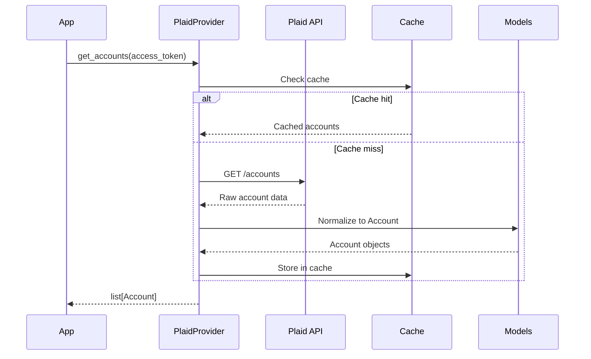
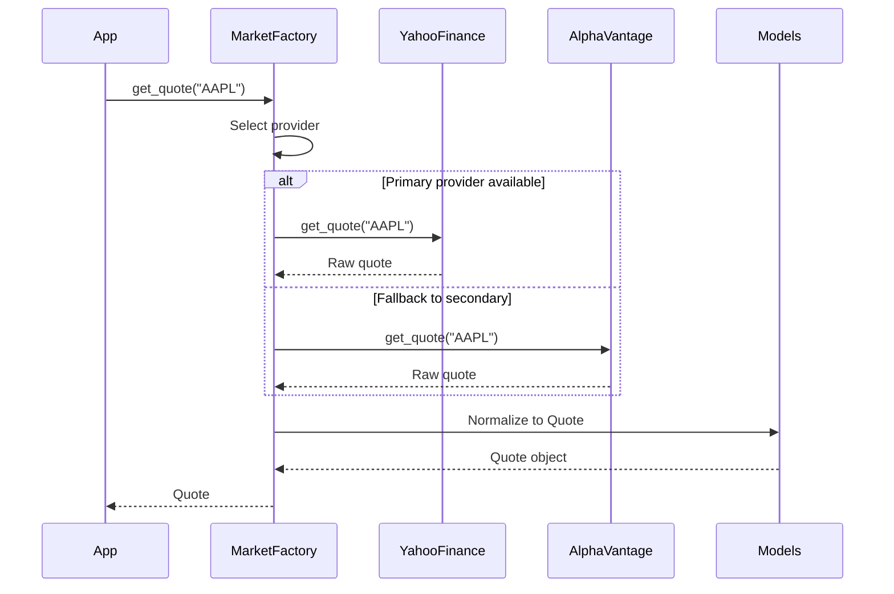
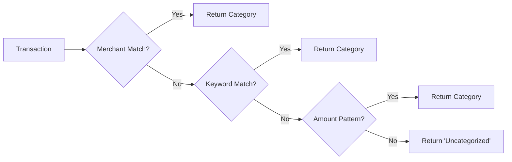
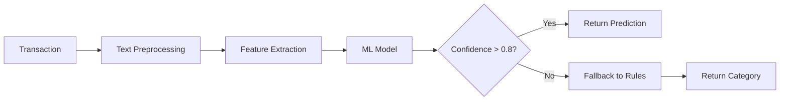
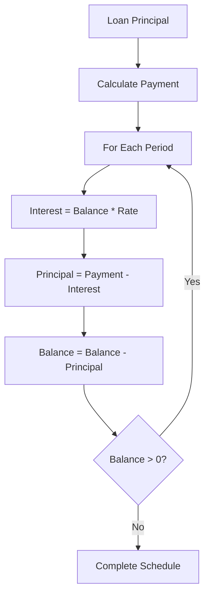

# Architecture Overview

fin-infra provides a modular architecture for building financial applications. The design separates concerns into distinct layers, enabling provider independence, data normalization, and extensibility.

## System Architecture

```
┌─────────────────────────────────────────────────────────────────────┐
│                        Application Layer                            │
│  (Your financial logic, dashboards, analytics, reporting)          │
├─────────────────────────────────────────────────────────────────────┤
│                        Analytics Layer                              │
│   Cashflows  │  Categorization  │  Forecasting  │  Risk Analysis   │
├─────────────────────────────────────────────────────────────────────┤
│                     Normalized Models Layer                         │
│   Account  │  Transaction  │  Quote  │  Candle  │  Holding         │
├─────────────────────────────────────────────────────────────────────┤
│                        Provider Layer                               │
│   Plaid  │  Stripe  │  Yahoo Finance  │  Alpha Vantage  │  IEX     │
├─────────────────────────────────────────────────────────────────────┤
│                        Caching Layer                                │
│          In-Memory Cache    │    Persistent Cache (Redis)          │
└─────────────────────────────────────────────────────────────────────┘
```

## Module Hierarchy

### Banking (`fin_infra.banking`)

Bank account and transaction access:

| Component | Purpose |
|-----------|---------|
| `PlaidProvider` | Plaid API integration |
| `Account` | Normalized account model |
| `Transaction` | Normalized transaction model |
| `Balance` | Account balance with currency |

### Market Data (`fin_infra.market`)

Stock and crypto market data:

- **YahooFinanceProvider** - Free market data
- **AlphaVantageProvider** - Premium market data
- **Quote** - Real-time price data
- **Candle** - OHLCV candlestick data
- **MarketFactory** - Provider auto-selection

### Billing (`fin_infra.billing`)

Payment processing integration:

- **StripeProvider** - Stripe API wrapper
- **Customer** - Customer model
- **Subscription** - Subscription management
- **Invoice** - Invoice handling
- **Webhook** - Event processing

### Cashflows (`fin_infra.cashflows`)

Financial calculations:

- **NPV** - Net Present Value
- **IRR** - Internal Rate of Return
- **Amortization** - Loan schedules
- **CashflowSeries** - Time series operations

### Categorization (`fin_infra.categorization`)

Transaction classification:

- **Categorizer** - Rule-based categorization
- **MLCategorizer** - ML-powered categorization
- **Category** - Category taxonomy
- **CategoryRule** - Matching rules

### Models (`fin_infra.models`)

Normalized data models:

- **Account** - Bank/brokerage account
- **Transaction** - Financial transaction
- **Quote** - Market quote
- **Candle** - Price candle (OHLCV)
- **Holding** - Portfolio position

---

## Data Flow

### Banking Data Flow



### Market Data Flow



---

## Provider Abstraction

### Provider Interface

All market data providers implement a common interface:

```python
class MarketDataProvider(ABC):
    @abstractmethod
    async def get_quote(self, symbol: str) -> Quote:
        """Get real-time quote for a symbol."""
        ...

    @abstractmethod
    async def get_history(
        self,
        symbol: str,
        start: date,
        end: date,
        interval: str = "1d",
    ) -> list[Candle]:
        """Get historical price data."""
        ...

    @abstractmethod
    async def search(self, query: str) -> list[SymbolInfo]:
        """Search for symbols."""
        ...
```

### Provider Selection

```python
from fin_infra.market import get_market_data, MarketFactory

# Auto-detect from available API keys
market = get_market_data()  # Uses Yahoo (free) or Alpha Vantage

# Explicit provider selection
market = MarketFactory.create(provider="alpha_vantage")

# With fallback chain
market = MarketFactory.create(
    providers=["alpha_vantage", "yahoo"],
    fallback=True,
)
```

---

## Categorization Pipeline

### Rule-Based Categorization



### ML-Powered Categorization



### Category Taxonomy

```
Income
├── Salary
├── Freelance
├── Investment Returns
└── Other Income

Expenses
├── Housing
│   ├── Rent/Mortgage
│   ├── Utilities
│   └── Insurance
├── Transportation
│   ├── Gas
│   ├── Public Transit
│   └── Car Maintenance
├── Food & Dining
│   ├── Groceries
│   ├── Restaurants
│   └── Coffee Shops
├── Shopping
│   ├── Clothing
│   ├── Electronics
│   └── Home Goods
└── Entertainment
    ├── Streaming
    ├── Games
    └── Events

Transfers
├── Internal Transfer
├── Investment Transfer
└── Loan Payment
```

---

## Caching Strategy

### Cache Layers

```
┌─────────────────────────────────────────────────────────────────────┐
│                     L1: In-Memory (LRU)                             │
│           Per-process, ~100ms TTL for quotes                        │
├─────────────────────────────────────────────────────────────────────┤
│                     L2: Redis (Optional)                            │
│         Shared cache, ~5min TTL for account data                    │
├─────────────────────────────────────────────────────────────────────┤
│                     L3: Provider API                                │
│              Rate-limited, billable API calls                       │
└─────────────────────────────────────────────────────────────────────┘
```

### Cache Configuration

```python
from fin_infra.market import MarketFactory

market = MarketFactory.create(
    provider="alpha_vantage",
    cache_ttl={
        "quote": 60,       # 1 minute for real-time quotes
        "history": 3600,   # 1 hour for historical data
        "search": 86400,   # 24 hours for symbol search
    },
)
```

### Cache Invalidation

```python
from fin_infra.market import get_market_data

market = get_market_data()

# Force fresh data
quote = await market.get_quote("AAPL", bypass_cache=True)

# Clear cache for symbol
await market.invalidate_cache("AAPL")

# Clear all cache
await market.clear_cache()
```

---

## Cashflow Calculations

### NPV Calculation

```python
from fin_infra.cashflows import npv, CashflowSeries
from decimal import Decimal

cashflows = CashflowSeries([
    Decimal("-100000"),  # Initial investment
    Decimal("25000"),    # Year 1
    Decimal("30000"),    # Year 2
    Decimal("35000"),    # Year 3
    Decimal("40000"),    # Year 4
])

discount_rate = Decimal("0.10")  # 10%
result = npv(cashflows, discount_rate)
print(f"NPV: ${result:.2f}")
```

### IRR Calculation

```python
from fin_infra.cashflows import irr, CashflowSeries

cashflows = CashflowSeries([
    Decimal("-100000"),
    Decimal("30000"),
    Decimal("35000"),
    Decimal("40000"),
    Decimal("45000"),
])

rate = irr(cashflows)
print(f"IRR: {rate:.2%}")
```

### Amortization Schedule



---

## Key Design Principles

### 1. Decimal Precision

Always use Decimal for financial calculations:

```python
from decimal import Decimal

# Good
price = Decimal("19.99")
quantity = Decimal("3")
total = price * quantity  # Decimal("59.97")

# Bad - floating point errors
price = 19.99
quantity = 3
total = price * quantity  # 59.97000000000001
```

### 2. Provider Independence

Write code that works with any provider:

```python
from fin_infra.market import MarketDataProvider

async def get_portfolio_value(
    provider: MarketDataProvider,
    holdings: list[Holding],
) -> Decimal:
    total = Decimal("0")
    for holding in holdings:
        quote = await provider.get_quote(holding.symbol)
        total += quote.price * holding.quantity
    return total
```

### 3. Normalized Models

All providers return the same models:

```python
from fin_infra.models import Quote

# Same Quote model from any provider
yahoo_quote: Quote = await yahoo.get_quote("AAPL")
alpha_quote: Quote = await alpha.get_quote("AAPL")

# Both have identical attributes
print(yahoo_quote.price)
print(alpha_quote.price)
```

### 4. Rate Limit Handling

Built-in rate limit management:

```python
from fin_infra.market import MarketFactory

market = MarketFactory.create(
    provider="alpha_vantage",
    rate_limit="5/minute",  # Alpha Vantage free tier
    retry_on_rate_limit=True,
)
```

---

## Integration Points

### With svc-infra

```python
from svc_infra import create_app, router
from fin_infra import PlaidProvider

app = create_app()
plaid = PlaidProvider()

@router.get("/accounts")
async def get_accounts(access_token: str):
    return await plaid.get_accounts(access_token)

@router.get("/transactions")
async def get_transactions(access_token: str):
    return await plaid.get_transactions(access_token)
```

### With ai-infra

```python
from ai_infra import Agent, tool
from fin_infra import get_market_data

market = get_market_data()

@tool
def get_stock_price(symbol: str) -> str:
    """Get current stock price."""
    quote = market.get_quote(symbol)
    return f"{symbol}: ${quote.price:.2f} ({quote.change_percent:+.2f}%)"

@tool
def analyze_portfolio(symbols: list[str]) -> str:
    """Analyze a list of stocks."""
    # ...

agent = Agent(tools=[get_stock_price, analyze_portfolio])
await agent.run("What's my tech portfolio worth? AAPL, GOOGL, MSFT")
```
